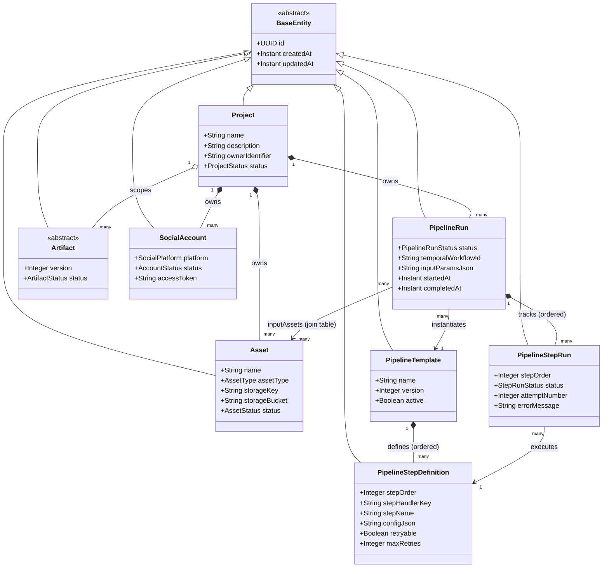
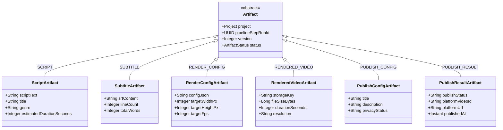
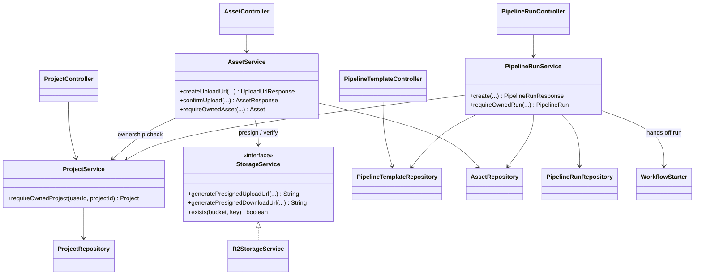
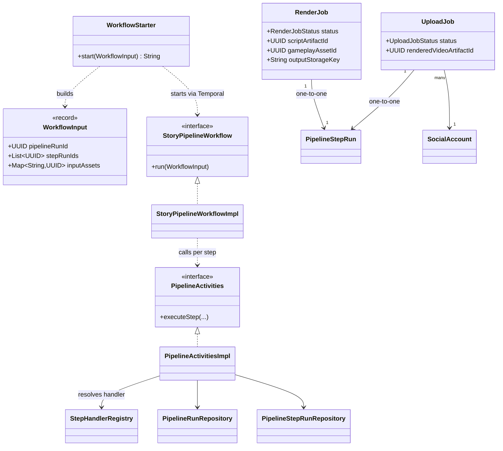

# ContentPipeline — Backend Class Diagram

A structural overview of the backend (`backend/src/main/java/com/contentpipeline`). The
diagrams are [Mermaid](https://mermaid.js.org/) — they render automatically on GitHub and
in VS Code (with a Mermaid preview extension).

The model is split into five views so each stays readable:

1. [Domain entities & relationships](#1-domain-entities) — the persisted data model
2. [Artifact hierarchy](#2-artifact-hierarchy) — single-table polymorphism
3. [The pipeline abstraction](#3-the-pipeline-abstraction) — the extensibility seam
4. [Services & web layer](#4-services--web-layer) — how requests are handled
5. [Workflow & async jobs](#5-workflow--async-jobs) — Temporal + background workers

> Scope note: this reflects classes that exist today. The Phase-4 story step handlers
> (`GENERATE_STORY`, etc.) are seeded as data but their handler classes are not written
> yet, so they appear only as the `PipelineStepHandler` interface, not concrete types.

---

## 1. Domain entities

Every entity extends `BaseEntity` (UUID id + created/updated timestamps). Status fields are
string-valued enums. Lazy `@ManyToOne` associations are marked `LAZY`.

**How to read it:** a `Project` is the top container. A `PipelineTemplate` is a reusable
blueprint; starting it creates a `PipelineRun` with one `PipelineStepRun` per
`PipelineStepDefinition`. Each step run produces `Artifact`s (scoped to the project, keyed
by `pipelineStepRunId`).

---

## 2. Artifact hierarchy

All artifact types share one `artifacts` table via JPA `SINGLE_TABLE` inheritance; the
`artifact_type` discriminator column selects the subtype. Each subtype's columns are sparse
(null for other types). Adding a type = one new `@DiscriminatorValue` subclass.

The subtypes line up with the four story steps: `GENERATE_STORY` → `ScriptArtifact`,
`GENERATE_SUBTITLES` → `SubtitleArtifact`, `RENDER_VIDEO` → `RenderConfig`/`RenderedVideo`,
`UPLOAD_VIDEO` → `PublishConfig`/`PublishResult`.

---

## 3. The pipeline abstraction

The single extensibility seam. A new pipeline step = a `@Component` implementing
`PipelineStepHandler`; `StepHandlerRegistry` auto-discovers it by `handlerKey()`. No
existing class changes.

```mermaid
classDiagram
    class PipelineStepHandler {
        <<interface>>
        +handlerKey() String
        +execute(StepContext) StepResult
    }

    class StepContext {
        <<record>>
        +UUID pipelineRunId
        +UUID pipelineStepRunId
        +UUID projectId
        +Map~String,UUID~ inputArtifactIds
        +Map~String,UUID~ inputAssetIds
        +Map~String,String~ stepConfig
        +String devUserId
    }

    class StepResult {
        <<record>>
        +boolean success
        +Map~String,UUID~ outputArtifactIds
        +String errorMessage
        +success(Map) StepResult$
        +failure(String) StepResult$
    }

    class StepHandlerRegistry {
        -Map~String,PipelineStepHandler~ handlers
        +hasHandler(String) boolean
        +getRequired(String) PipelineStepHandler
    }

    class StepExecutionException {
        +boolean retryable
    }

    StepHandlerRegistry o-- "many" PipelineStepHandler : indexes by handlerKey
    PipelineStepHandler ..> StepContext : consumes
    PipelineStepHandler ..> StepResult : produces
    PipelineStepHandler ..> StepExecutionException : throws
```

---

## 4. Services & web layer

REST controllers delegate to `@Transactional` services. The caller identity is the
`X-Dev-User-Id` header (auth seam). Services enforce ownership and 404-not-403 on access.

---

## 5. Workflow & async jobs

Pipelines run as Temporal workflows; each step is an Activity. The activity looks up the
right `PipelineStepHandler` via the registry. Long-running work (render, upload) is offloaded
to DB-backed job rows that scheduled workers claim and process.

---

### Legend

| Mermaid notation | Meaning |
|---|---|
| `<\|--` | inheritance (extends) |
| `<\|..` | interface realization (implements) |
| `*--` | composition (owns; lifecycle-bound) |
| `o--` | aggregation (references; independent lifecycle) |
| `-->` | association (has-a / uses) |
| `..>` | dependency (transient use: param, return, throws) |
| `"1" / "many"` | multiplicity |
